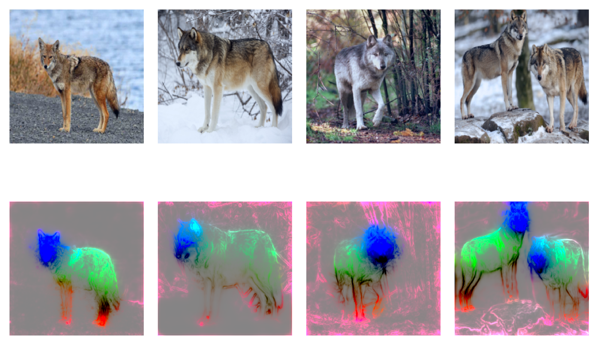

# PRISM - **Pr**incipal **I**mage **S**ections **M**apping


A novel tool that utilizes Principal Component Analysis to display discriminative featues detected by a given convolutional neural network.
It complies with virtually all CNNs.

### Demo

[Simplest snippet](SoftwareX_snippet/snippet.py) of working code.

```python
import sys
sys.path.insert(0, "../")
from torchprism import PRISM
from torchvision import models
from utils import load_images, draw_input_n_prism

# load images into batch
input_batch = load_images()

model = models.vgg11(pretrained=True)
model.eval()
PRISM.register_hooks(model)

model(input_batch)
prism_maps_batch = PRISM.get_maps()

drawable_input_batch = input_batch.permute(0, 2, 3, 1).detach().cpu().numpy()
drawable_prism_maps_batch = prism_maps_batch.permute(0, 2, 3, 1).detach().cpu().numpy()

draw_input_n_prism(drawable_input_batch, drawable_prism_maps_batch)
```
First we have to import PRISM and torch models., as well as functions for preparing input images as simple torch batch and function to draw batches. Next we have to load the model, in this case a pretrained vgg11 has been chosen and then we have to call the first PRISM method to register required hooks in the model.
With such a prepared model we can perform the classification and, since the actual output is not needed, we can just ignore it. Model execution is followed by using the second PRISM method to calculate features maps for the processed batch. Finally we have to prepare both input and PRISM output so they can be drawn and as the last step we call a method that displays them using e.g. matplotlib.

### Results

The results allow us to see the discriminative features found by the model.
On the sample images below we can see wolves



### Citation
Currently in the form of pre-print, but hope soon as publication.

```raw
@misc{szandala2021torchprism,
      title={TorchPRISM: Principal Image Sections Mapping, a novel method for Convolutional Neural Network features visualization},
      author={Tomasz Szandala},
      year={2021},
      eprint={2101.11266},
      archivePrefix={arXiv},
      primaryClass={cs.CV}
}
```

